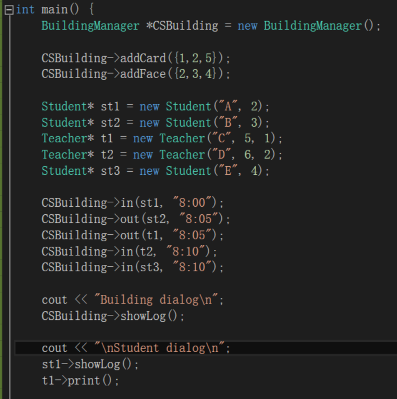
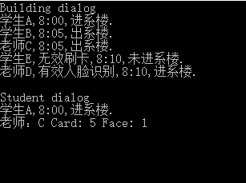

# 高级程序设计 作业五

#### 151271022 王环宇

任务：利用面向对象的编程设计模拟院楼的门禁管理系统。

具体内容：

有登记的老师和同学可以进入系楼。同学只能通过卡，而老师可以通过卡和脸。


## 类别信息
### BuildingManager

成员函数：

```cpp
void addCard(vector<int> cards);
void addFace(vector<int> faces);
void deleteCard(vector<int> cards);
void deleteFace(vector<int> faces);
void deleteCard(int card);
void deleteFace(int face);			// 增删操作

void clearCard();
void clearFace();					// 全部清除

void printCard();
void printFace();					// 打印输出

bool checkFace(int face);
bool checkCard(int card);			// 检查是否有权限

void addLog(Log& newLog);			// 新增日志条例
void showLog();						// 对日志进行排序输出

void in(People* p, string time);	// 使用多态的方法，添加进入系楼的操作
void out(People* p, string time);	// 添加离开系楼的操作
```

##### 成员变量

```cpp
set<int> card_info;			// 使用集合表示卡片信息和脸信息
set<int> face_info;
vector<Log> log;			// 使用vector保存日志信息
```

按照时间先后和进出的关系对日志进行排序，每条日志是一个对象，而输出日志则可以调用日志对象的成员函数进行输出。


### People

是一个虚基类，规定了Teacher和Student必须要有的接口，同时也能够在和BuildingManager交换信息的过程中使用多态。

##### 成员函数

```cpp
virtual void print() = 0;		// 输出对象基本的信息，如姓名和身份
virtual Log& addLog(string time, bool in, bool checkCard, bool checkFace = false)=0;
	// 添加日志的函数，需要在其派生类中完成这个操作
int getCard();
virtual int getFace() = 0;		
void showLog();					// 显示个人的日志
```

##### 成员变量

```cpp
protected:				// 不会创建People对象，所以使用protected进行约束
	string name;
	int card_number;
	vector<Log> log;	// 无论是Teacher还是Student都必须要有的变量
```


### Teacher

继承People类，对老师这个功能体的展示。

##### 成员函数

```cpp
int getFace();

Log& addLog(string time, bool in, bool checkCard, bool checkFace = false);
void print();			// 完善了在People中定义的接口
```

##### 成员变量

```cpp
int face_number;
```

除此之外还定义了一个face数据，这是老师独有的解锁门禁方法。


### Student

继承People类，对学生这个功能题的展现。


### Log

用于记录，记录既会保存在BuildingManager中，也会保存在Teacher和Student类中。与记录有关的内容会以成员变量的形式保存，但同时也能够导出字符串用于显示。

##### 成员函数

```cpp
Log& getLog();
string showLog();
```

##### 成员变量

```cpp
string name;		// 被记录者的姓名
string identity;	// 被记录者的身份
string time;		// 进出的时间
bool in;			// 进/出
bool result;		// 是否进出成功
bool method;		// 通过何种方式完成验证
```


## 运行过程








## 关键程序

关键的程序部分是自定义一个排序的算法，然后将其链接到容器中的sort函数。

```cpp
bool comp(const Log& a,const Log& b) {
	string a_first = a.time.substr(0, a.time.find(":"));
	string a_second = a.time.substr(a.time.find(":") + 1, a.time.size());
	int a1 = atoi(a_first.c_str());
	int a2 = atoi(a_second.c_str());

	string b_first = b.time.substr(0, b.time.find(":"));
	string b_second = b.time.substr(b.time.find(":") + 1, b.time.size());
	int b1 = atoi(b_first.c_str());
	int b2 = atoi(b_second.c_str());

	if (a1 < b1)
		return true;
	else if (a1 > b1)
		return false;
	else {
		if (a2 < b2)
			return true;
		else if (a2 > b2)
			return false;
		else {
			if (!(b.in))
				return false;
			return true;
		}
	}
	return true;
}
```

